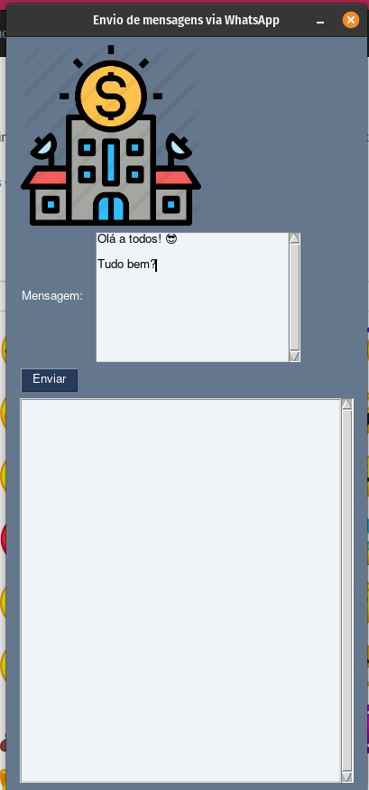

<h1 align="center">
  Bot para enviar mensagem, através de uma lista de contatos - Usando Interface Gráfica
</h1>

 

 
  
## 📝 Descrição 
 
Bot em Python para Whatsapp ️➡ ️️Envio de mensagem através de uma lista de contatos - Usando Interface Gráfica

## 🚀 Tecnologias

Esse projeto foi desenvolvido com as seguintes tecnologias:

- Python

## 📚 Bibliotecas

- [PyWhatKit](https://pypi.org/project/pywhatkit/)
- [PySimpleGUI](https://www.pysimplegui.org/)

## 📩 Install:
- Python
- [PyWhatKit](https://pypi.org/project/pywhatkit/) - Instalar biblioteca pip
- [PySimpleGUI](https://pypi.org/project/PySimpleGUI/) - Instalar biblioteca pip
- Whatsapp

## 🔗 Links

 
 

 

-----

  <h3 align="center"> Developed by <a href="https://github.com/felipejohnson/">Felipe Johnson</a> ☕</h3>
